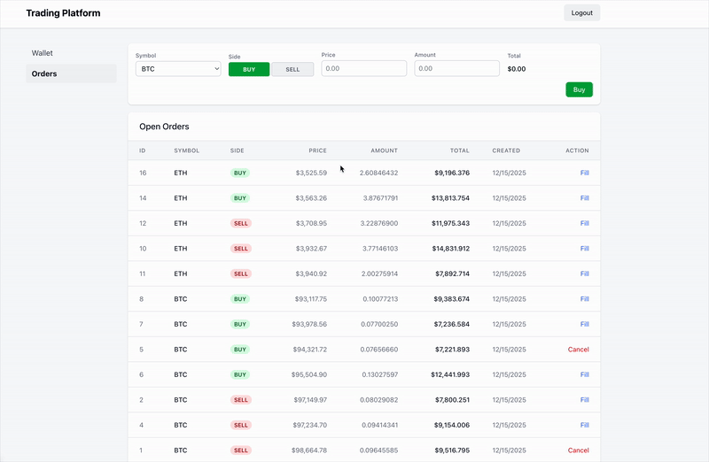

# Trading Platform

A full-stack cryptocurrency trading platform with real-time order matching and WebSocket updates.

> This project was built as a technical assignment for a software engineering position. See [REQUIREMENTS.md](REQUIREMENTS.md) for the full specification.



## Tech Stack

| Layer | Technology |
|-------|------------|
| Backend | Laravel 12, PHP 8.3, Sanctum |
| Frontend | Vue 3 (Composition API), TypeScript, Pinia, Tailwind CSS 4 |
| Database | PostgreSQL 16 |
| Real-time | Soketi (Pusher-compatible WebSocket) |
| Queue/Cache | Redis 7 |
| Web Server | Caddy 2 |

## Features

- User authentication with Laravel Sanctum
- USD balance and crypto asset management (BTC, ETH)
- Limit order placement (buy/sell)
- Order matching engine with price-time priority
- 1.5% commission on trades (deducted from buyer)
- Real-time balance and order updates via WebSocket
- Order cancellation with fund/asset release

## Quick Start


```bash
git clone <repository-url>
cd trading_platform
make build
make setup
```

Open http://localhost:5173 in your browser.

## Available Commands

```bash
make help          # Show all commands
make up            # Start containers
make down          # Stop containers
make logs s=app    # View logs for a service
make shell         # Open shell in app container
make test          # Run tests
make fresh         # Reset database with seeders
make tinker        # Laravel REPL
```

## API Endpoints

| Method | Endpoint | Description |
|--------|----------|-------------|
| POST | `/api/login` | Authenticate user |
| POST | `/api/logout` | Logout user |
| GET | `/api/profile` | Get balance and assets |
| GET | `/api/symbols` | List tradeable symbols |
| GET | `/api/orders?symbol=BTC` | Get orderbook |
| POST | `/api/orders` | Place limit order |
| POST | `/api/orders/{id}/cancel` | Cancel order |

## Architecture

```
trading_platform/
├── api/                    # Laravel backend
│   ├── app/
│   │   ├── Actions/        # PlaceBuyOrder, PlaceSellOrder, MatchOrder, CancelOrder
│   │   ├── Events/         # OrderMatched (broadcast)
│   │   └── Models/         # User, Asset, Order, Trade, Symbol
│   └── config/trading.php  # Commission rate config
├── frontend/               # Vue.js frontend
│   ├── src/
│   │   ├── stores/         # Pinia stores (auth, trading)
│   │   └── views/          # Wallet, Orders, Trade views
└── docker-compose.yml      # All services
```

## Order Matching Logic

**Buy order**: Matches with lowest-priced sell order where `sell.price <= buy.price`

**Sell order**: Matches with highest-priced buy order where `buy.price >= sell.price`

**Commission**: 1.5% deducted from buyer's received assets

## Real-time Events

Orders broadcast to private channels (`private-user.{id}`) when matched:
- Balance updates
- Asset updates
- Order status changes

## Development

```bash
# Backend tests
make test

# Frontend dev server (already running via Docker)
# Or run locally:
cd frontend && npm run dev

# Frontend tests
cd frontend && npm test
```

## Environment

Copy example env files for local development:
```bash
cp api/.env.example api/.env
cp frontend/.env.example frontend/.env
```

## License

MIT